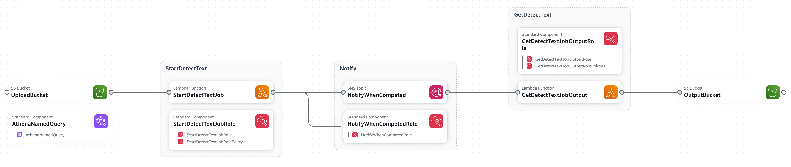

# Using AWS OCR Textract + AWS S3 + AWS Athena to Extract and Query text from Scanned Contracts

## Overview 

The objective of this project is to extract text from a collection of scanned contracts and other business documents using AWS Textract, an Optical Character Recognition (OCR) service. 

The extracted text will be transformed into a plain text format and stored in a Parquet format, with the page number information preserved.

This approach will enable text searching using regular expressions, particularly for locating documents related to a specific person within the documents. As the main focus is on searching by full names of people, there is no need for explore more sofisticated indexing technologies.

The Parquet file saved into a AWS S3 Buckect will serve as a simple, structured and efficient storage solution for the extracted text data, allowing for easy querying and analysis direct by AWS Athena. 

By retaining the page number information, the extracted text can be traced back to its original location within the source documents, providing valuable context.

Overall, this project aims to streamline the process of extracting and searching text from a large corpus of business documents, enabling faster and more accurate information retrieval, especially when it comes to identifying and locating contractor details.

For educational purposes this project demonstrates how to use AWS Textract, a machine learning service that automatically extracts text and data from scanned documents. 

AWS Textract provides two main functionalities:

1. **Optical Character Recognition (OCR)**: Detect and extract text from document images.
2. **Data Extraction**: Identify and extract data from forms and tables within document images.

## Architecture

The application follows a serverless architecture, leveraging various AWS services:

- **AWS S3**: Stores the uploaded PDF documents and output results.
- **AWS Lambda**: Starts the Document Text Detection asynchronous service on AWS Textract and implements the format logic for the result building a Dataframe with the columns: Document, Page, Content.
- **Amazon SNS**: Provides a notification channel between AWS Textract service and the downstream AWS Lambda function to process the result of extraction.
- **AWS Athena**: Allows to directly query the Parquet files containing the extracted text data from the scanned documents without the need for setting up and managing a separate data warehouse or database.
- **AWS Application Composer**: Provides a canvas based interface to visually design the architecture, like the image below. It is optional for designing the architecture.
- **AWS SAM**: Defines and manage the solution's infrastructure as code (IaC) enabling consistente deployments.



## Prerequisites

To launch this project you will need the following:

- AWS Account, AWS CLI and AWS SAM configured with appropriate permissions.

Detailed instructions can be found at:

- AWS SAM Prerequisites: https://docs.aws.amazon.com/serverless-application-model/latest/developerguide/prerequisites.html
- AWS SAM Installation Guide: https://docs.aws.amazon.com/serverless-application-model/latest/developerguide/install-sam-cli.html

## Setup

1. Clone the repository:
```bash
git clone https://github.com/angelovelloso/aws-ocr-textract.git
cd aws-ocr-textract
```

2. Build and Deploy the application in AWS using SAM CLI:
```bash
sam build
sam deploy --capabilities CAPABILITY_NAMED_IAM --guided
```

3. Pay attention to **Stack Name** you typed. It is the first question in the guided deployment.

## Usage
1. Upload your PDF scanned documents to the upload S3 bucket `s3://<your-stack-name>-upload-<your-region>`.

2. Wait the Lambda function to be triggered for processing workflow. You can monitor it in Monitoring tab.

3. Check the output S3 bucket for the extracted text and data files `s3://<your-stack-name>-output-<your-region>`.

4. Once the output files are created. Go to AWS Athena Query Editor and search for Saved Queries.

5. Run the query saved with the name "CreateDocsIndexTable". It will create the Table and Metadata pointing to your Bucket and Parquet files.

6. Now you can query your data to find any pattern you want. Open another Query Editor and use this snippet:
```sql
select * from docs
where regexp_like(docs.content, '<what-you-want-to-find-in-documents>');
```

## Cleanup

To delete the AWS resources created by this project:

1. Assert the s3 buckets are empty via UI or using the AWS CLI
```bash
aws s3 rm s3://<your-stack-name>-upload-<your-region> --recursive
aws s3 rm s3://<your-stack-name>-output-<your-region> --recursive
```

2. Run SAM CLI delete command:
```bash
sam delete 
```

## Contributing
Contributions are welcome, although I personaly don't want to extend this project. It meets desired goals.

Please open an issue or submit a pull request.

## License
This project is licensed under the MIT License.

## Contact
For any questions or inquiries, please contact:

Ângelo Velloso

Linked In: https://www.linkedin.com/in/angelovelloso/?locale=en_US
E-mail: vellosov@hotmail.com
